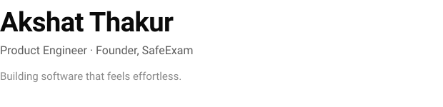

<picture>
  <source media="(prefers-color-scheme: dark)" srcset="assets/hero-dark.svg">
  <source media="(prefers-color-scheme: light)" srcset="assets/hero-light.svg">
  
</picture>

 

The best software disappears.

It quietly helps people accomplish meaningful work without asking them to think about the technology behind it.

That's the kind of software I aspire to build.

 

## Selected Work

**SafeExam**

A secure assessment platform designed for institutions where trust, reliability, and thoughtful engineering matter more than feature count.

→ Explore

 

**MailMyCertificate**

Browser-first certificate automation that keeps the experience simple, fast, and privacy-first.

→ Explore

 

**AthletixOS**

Digital infrastructure for modern sports academies, designed to stay invisible while supporting everyday operations.

→ Explore

 

## How I Think

I care less about the frameworks behind a product and more about how naturally people can use it.

I believe thoughtful engineering, calm design, and clear product thinking should work together to reduce effort—not add complexity.

Technology should disappear.
People should simply accomplish what matters.

 

## Current Focus

I'm currently refining **SafeExam** while continuing to explore secure systems, browser-first software, and products that people can trust for years—not just today.

 

---

Building software that feels effortless.

[Email](mailto:thakurakshat013@gmail.com) ·
[LinkedIn](https://www.linkedin.com/in/akshatthakur22/) ·
[X](https://x.com/akshatt66612958)
